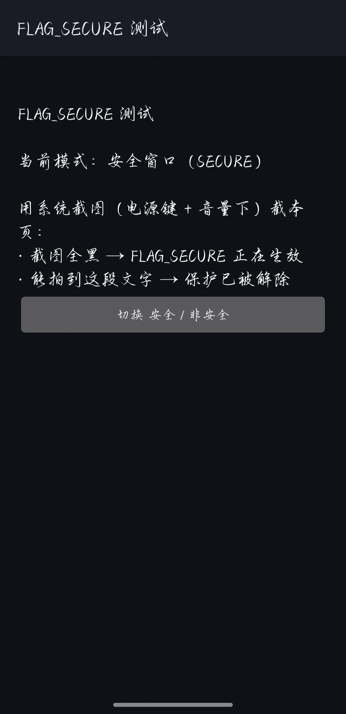
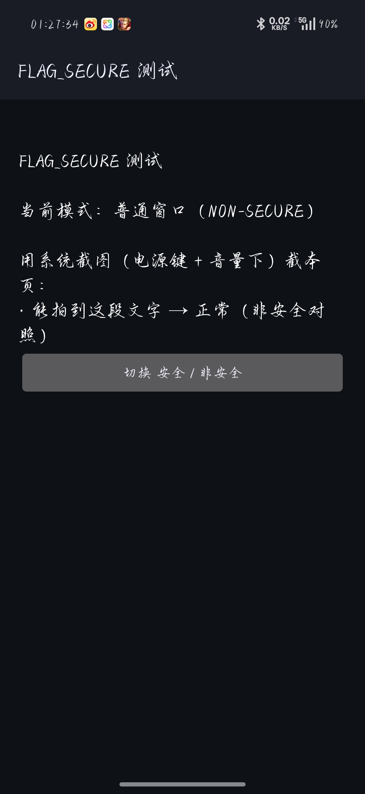

# FLAG_SECURE Test


[](LICENSE)
[](../../releases)

A **tiny Android test app** that shows whether system-wide "enable screenshot" tweaks are working — e.g. LSPosed's **Enable Screenshot / DisableFlagSecure**, or Magisk SurfaceFlinger patches.

Install it, open it, take a screenshot. Check whether the screenshot succeeds，**Black or not black** — you instantly know whether your module actually works.

> Chinese: [README.md](README.md)

---

## Why this exists

Android lets an app block screenshots/screen-recording by setting the window flag `FLAG_SECURE` (commonly used by banking apps, payment QR pages, privacy screens).

When you use a module like **Enable Screenshot / DisableFlagSecure** to lift that restriction, you need a **reliable, clean, purpose-built target** to verify it — but most test packages out there are either ancient 2017 builds (won't install on modern Android) or come bundled with unrelated permissions.

This app exists for exactly that: **~12 KB, zero permissions, no network, no tracking** — it does one thing: provide a toggleable `FLAG_SECURE` window.

## Screenshots

| Secure window (SECURE) | Normal window (NON-SECURE) |
|---|---|
|  |  |

> If text is visible in **SECURE** mode, your unlock module is working.

## Features

- Starts as a **secure window (SECURE)** with `FLAG_SECURE` set
- One tap to toggle **secure / non-secure** for easy A/B comparison
- `minSdk 24` / `targetSdk 34` — runs on **Android 7.0 through 15+**
- No permissions, no ads, no network, no background services
- Fully open source, essentially a single Activity

## Background: what is FLAG_SECURE

`WindowManager.LayoutParams.FLAG_SECURE` is an Android window flag. When set, the system:

- blocks screenshots / screen-recording of that window (captures come out black);
- hides the window's thumbnail in **Recents**.

It is widely used to protect sensitive UI. This app sets it via `getWindow().setFlags(FLAG_SECURE, FLAG_SECURE)` to act as a test target.

## Usage

1. **Install** the APK (see [Releases](../../releases)).
2. **Open** the app — it starts in **"secure window (SECURE)"** mode.
3. Take a **system screenshot** (Power + Volume Down):
   - **Entirely black** → `FLAG_SECURE` is active (the system is protecting it);
   - **You can read the text** → protection is **lifted** (your unlock module works ✅).
4. Tap **"Toggle secure / non-secure"** and screenshot again to compare.

### Result matrix

| Current mode | Without unlock module (expected) | With a working unlock module (expected) |
|---|---|---|
| Secure (SECURE) | all black | text is visible |
| Normal (NON-SECURE) | text is visible | text is visible |

> If **SECURE** mode is capturable, the unlock module is in effect.

## Build

No Gradle. Built directly with the Android SDK's `aapt2` / `d8` (or R8) / `zipalign` / `apksigner` — see [`build.sh`](build.sh).

Requirements:

- JDK 17+ (to run `d8`/`apksigner`)
- Android SDK `build-tools` (provides `aapt2`, `d8`/R8, `zipalign`, `apksigner`)
- An `android.jar` from a platform (e.g. android-34)

Edit the paths at the top of `build.sh`, then:

```bash
bash build.sh
```

The signed output is `out/FlagSecureTest.apk`.

## Project layout

```
.
├── src/
│   ├── AndroidManifest.xml
│   ├── res/values/strings.xml
│   └── java/fun/test/flagsecure/MainActivity.java
├── build.sh
├── screenshots/
├── dist/FLAG_SECURE_test.apk   # prebuilt installable APK
├── CHANGELOG.md
├── README.md                   # Chinese
└── LICENSE
```

## FAQ

**Q: The screenshot is all black — is the app broken?**
A: No. That is the expected behavior of `FLAG_SECURE` — exactly what we're reproducing.

**Q: In SECURE mode I *can* capture the text — what does that mean?**
A: Your device already has an "enable screenshot" module (LSPosed's Enable Screenshot, a Magisk patch, etc.) taking effect system-wide.

**Q: Why not just test with a banking app?**
A: You can, but banking/payment apps often add root detection and hardware-level protection too, which muddies the result. This app isolates `FLAG_SECURE` itself.

**Q: My target app is still black even with an unlock module.**
A: Make sure the module is enabled and the phone has been rebooted. If the screenshot is still black or cannot be taken at all,then it isn't using plain `FLAG_SECURE` but stronger hardware-level / DRM protection (secure video path, self-drawn secure layer, etc.), which common modules can't bypass.

## Disclaimer

Provided for **technical study, development, and module verification** and other lawful uses only. Do not use it to defeat others' legitimate security measures, invade privacy, or for any illegal purpose. Use at your own risk.

## License

[MIT](LICENSE)
